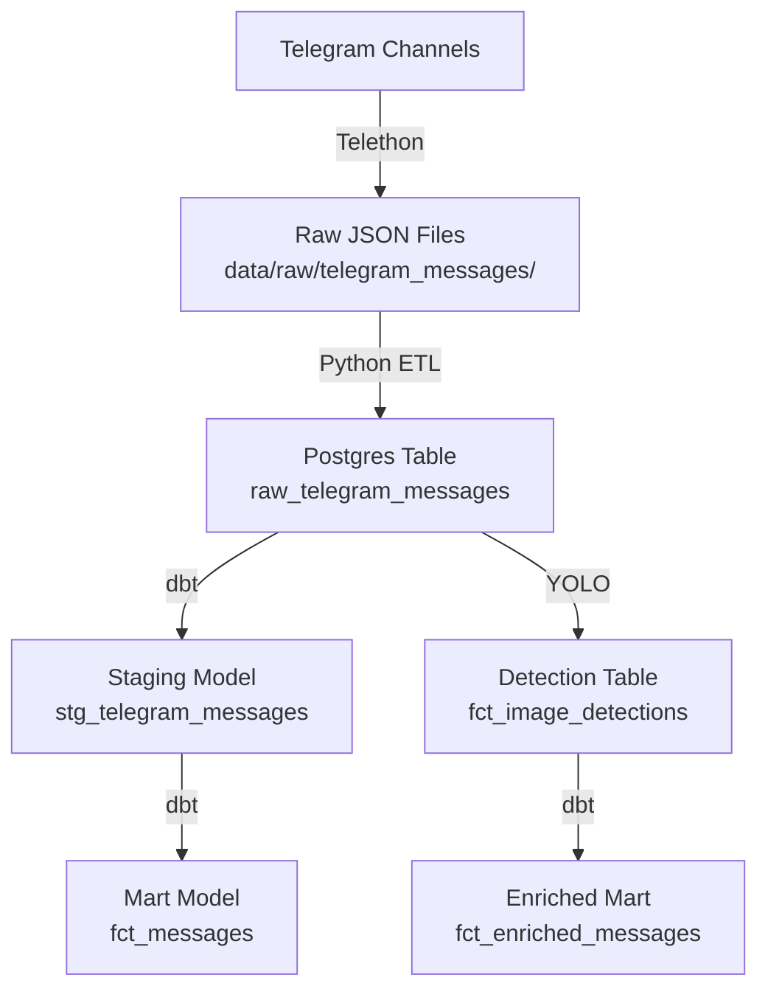

# Ethiomed Insights Pipeline

## Project Overview
A modern ELT pipeline for scraping, enriching, and analyzing Ethiopian medical business data from Telegram channels. The pipeline uses Telethon for scraping, YOLOv8 for image enrichment, dbt for modeling, and FastAPI for analytics.

## Folder Structure
```
miot-pipeline/
├── api/
├── data/
│   └── raw/
├── dbt_project/
├── docker/
├── etl/
├── orchestration/
├── .env
├── .gitignore
├── docker-compose.yml
├── Dockerfile
├── requirements.txt
└── README.md
```

## Setup Instructions
1. Clone the repo and install dependencies.
2. Add your `.env` file with Telegram and Postgres credentials.
3. Start Docker containers:
   ```bash
   docker-compose up -d
   ```
4. Scrape Telegram data:
   ```bash
   docker-compose exec app python etl/scrape_telegram.py
   ```
5. Load data to Postgres:
   ```bash
   docker-compose exec app python etl/load_to_postgres.py
   ```
6. Run YOLO enrichment:
   ```bash
   docker-compose exec app python etl/run_yolo_detection.py
   ```
7. Run dbt models:
   ```bash
   cd dbt_project
   dbt run
   dbt test
   ```

## Pipeline Diagram


## Known Issues / TODOs
- Dependency conflicts may occur with numpy/decorator/tensorflow; see pip warnings.
- Add more dbt tests and documentation.
- Add FastAPI endpoints for analytics (Task 4).
- Add Dagster orchestration (Task 5).

## Contact
For questions, contact the project maintainer. 